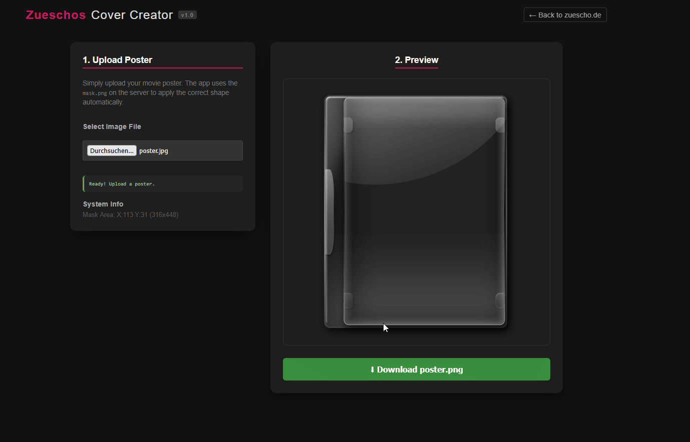

# Zueschos Cover Creator v1.1

A lightweight, web-based tool to generate 3D covers automatically.  

**You can find a [live demo over at zuescho.de/cover](https://zuescho.de/cover)**

---

## 🚀 How It Works

This tool runs entirely in the browser (client-side) using the HTML5 Canvas API. It solves the problem of manually aligning posters into a 3D template by using a **Smart Masking System**.

### The "Auto-Mask" Logic
Instead of hardcoding coordinates (which breaks if you change the template), the app dynamically scans a file named `assets/mask.png` when it loads.

1.  **Scan:** The app reads the pixels of `mask.png`.
2.  **Detect:** It looks for non-transparent pixels to find the "Safe Zone" (the blue area of the case).
3.  **Calculate:** It calculates the exact X, Y, Width, and Height of that area.
4.  **Apply:** When you upload a poster, it automatically scales and crops it to fit exactly inside that detected area, then layers the plastic case overlays on top.

This means if you ever want to change the case shape, you only need to update the images in the `assets` folder, no code changes required!

---

## Credits

* **App Created By:** Zuescho (with assistance from Gemini AI)
* **Blu-ray Case Template:** [DVD Plastic Case Resource](https://www.deviantart.com/920r9/art/DVD-Plastic-Case-for-GIMP-106113654) by 920r9 (DeviantArt)
* **Inspired By:** [Aikino](https://github.com/omegas82128/Aikino) by omegas82128

---

## 📝 License

This project is open for personal use. Please respect the licenses of the original assets and inspirations linked above.

